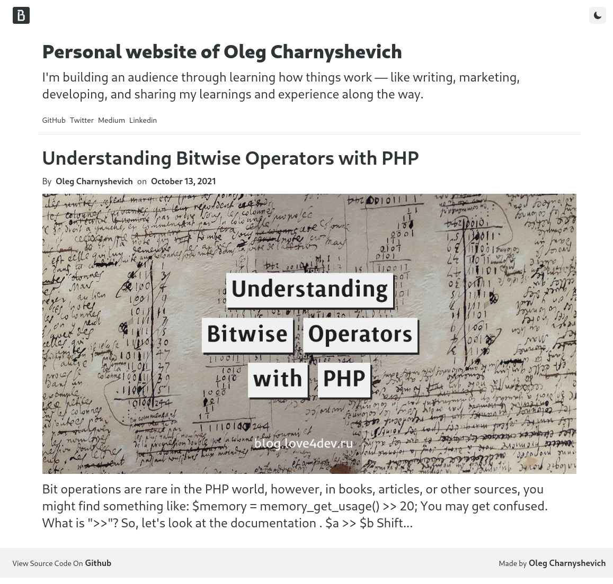
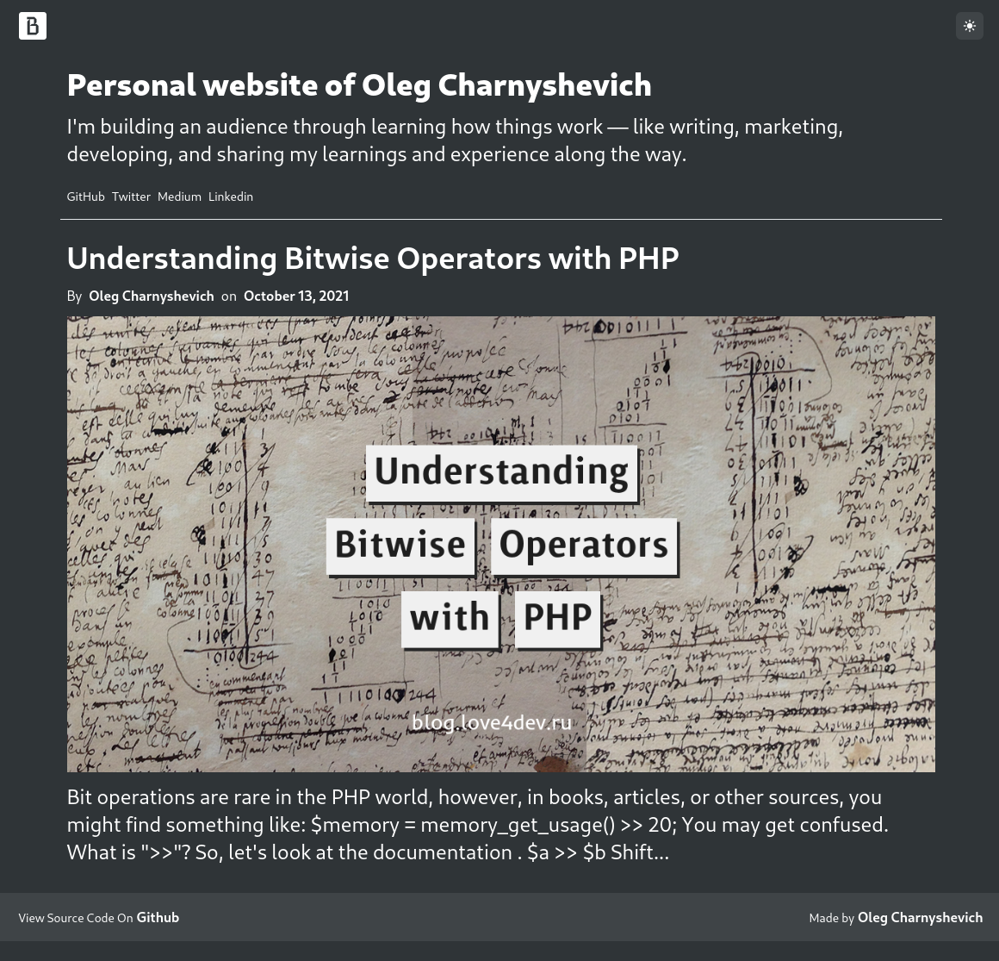

# Rss viewer

A simple beautiful RSS Viewer with VueJS

Blog white screenshot  |  Blog dark screenshot
:-------------------------:|:-------------------------:
  |  

## Project setup
```
npm install
```

### Compiles and hot-reloads for development
```
npm run serve
```

### Compiles and minifies for production
```
npm run build
```

### Lints and fixes files
```
npm run lint
```

## Deploy a project to GitHub page
Change name of your project in `vue.config.js`
```js
module.exports = {
    publicPath: process.env.NODE_ENV === "production" ? "/YOUR-PROJECT-NAME/" : "/",
}
```

```bash
$ npm run build
$ git add dist && git commit -m 'adding dist subtree'
$ git subtree push --prefix dist origin gh-pages
```

### Customize configuration
See [Configuration Reference](https://cli.vuejs.org/config/).
